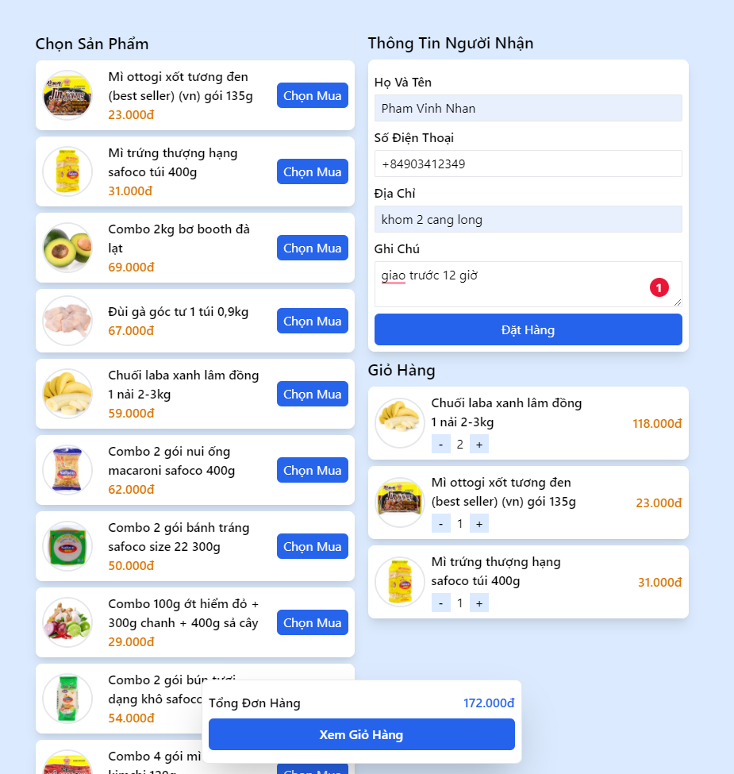
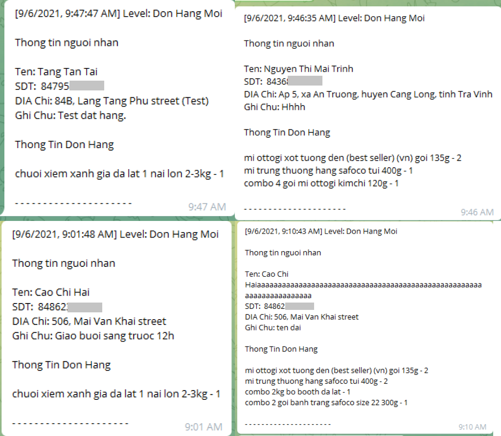

# Fast Store - [Live Demo](https://store.vinhnhan.com)

A lightweight shopping store allows the store's owner can deploy and run it as fast as possible

Due to Covid-19, Many store's owners need a fast shopping store for their customers

## Project Information

- Phạm Vĩnh Nhân - Full-Stack + Planner
- Implement Time: 1 day

## Technology

- Frontend
     - ReactJS
     - Redux-toolkit - Global State management
     - React-Hook-Form - Flexible and extensible forms
     - Tailwind - Styling
- Backend
     - NestJS - Server core
     - Typeorm + Mysql2 - Database

## Project Image

## Extend Feature

- Supporting multiple languages
- Payment

## Bug Report

Feel free to create an issue request anytime we will check it out and fix it as soon as possible. Thank You So Much.

## Contact

Please contact me, if you want to use this project for your business, this is a free project
